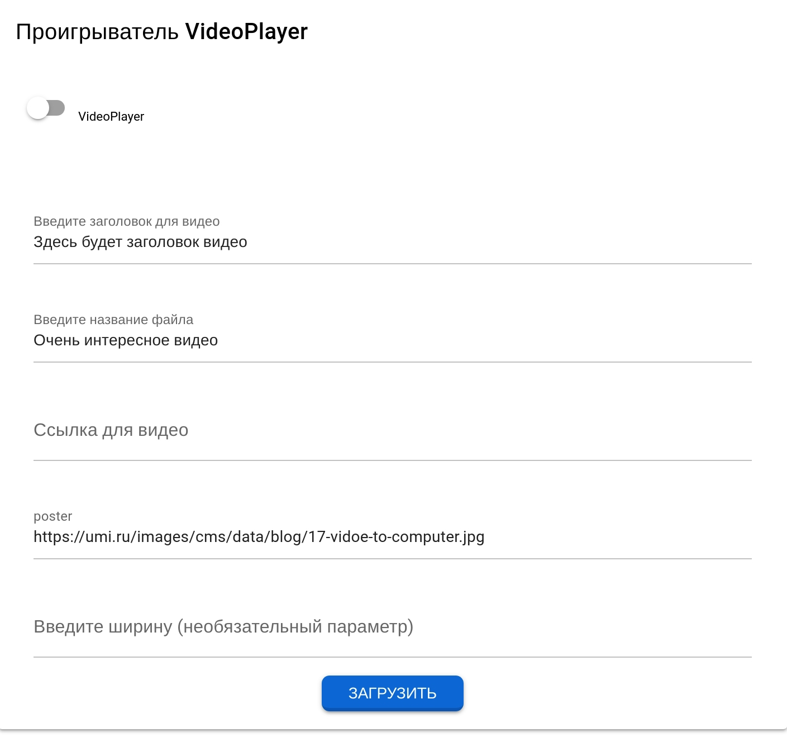
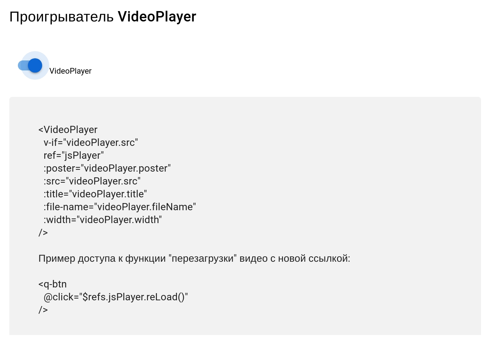
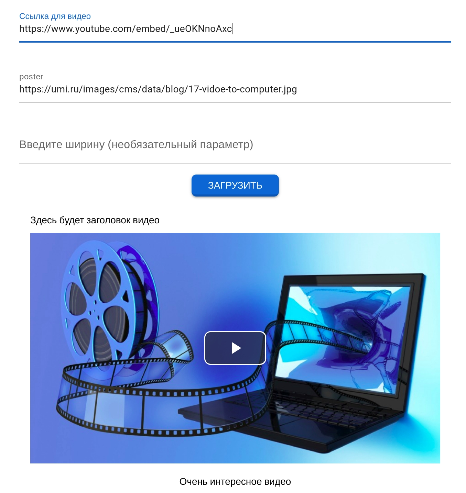
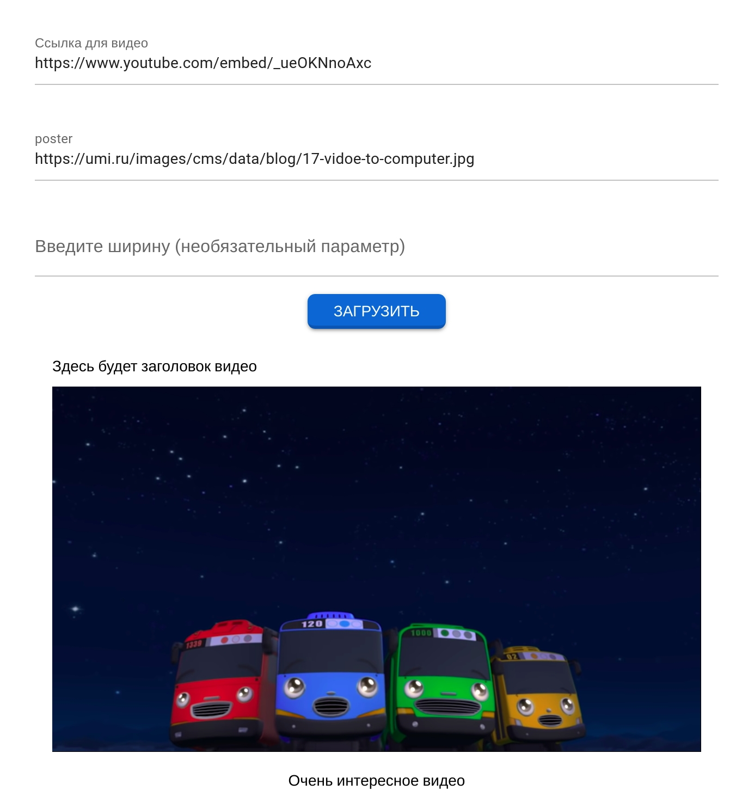

# Video player 

This Video player using Quasar Framework, based on Video.js. It supports HTML5 video, YouTube (through plugin - videojs-youtube) and streaming video (dash and hls formats)

### Usage
```bash
git clone https://github.com/jgordaja/Video-player.git
cd Video-player
```

Install the dependencies
```bash
yarn
```

Start the app in development mode (hot-code reloading, error reporting, etc.)
```bash
quasar dev
```

## An example of what it looks like


  

  

  



## Links to videos (for verification)

youtube (I checked different kinds of links). The same video, with different links:  
https://www.youtube.com/embed/_ueOKNnoAxc  
https://youtu.be/_ueOKNnoAxc  
https://www.youtube.com/watch?v=_ueOKNnoAxc&ab_channel=%D0%9F%D1%80%D0%B8%D0%BA%D0%BB%D1%8E%D1%87%D0%B5%D0%BD%D0%B8%D1%8F%D0%A2%D0%B0%D0%B9%D0%BETayoRussianOfficial  

mp4:  
https://vjs.zencdn.net/v/oceans.mp4

webm:  
https://vjs.zencdn.net/v/oceans.webm

ogg:  
https://vjs.zencdn.net/v/oceans.ogv

hls:  
https://s3.amazonaws.com/_bc_dml/example-content/bipbop-advanced/bipbop_16x9_variant.m3u8

dash:  
https://s3.amazonaws.com/_bc_dml/example-content/sintel_dash/sintel_vod.mpd
